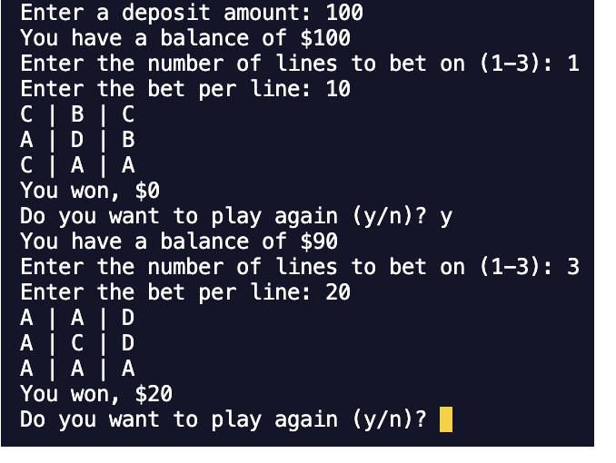

# Spin-and-Win

## Description

This is a Node.js command-line application that takes in user input to spin a slot machine and match the icons in each row to win. The application prompts the user to enter a deposit amount, select the number of lines to bet on and enter the amount they want to bet per line.

## Table of Contents 

- [Built With](#built-with)
- [Installation](#installation)
- [Usage](#usage)
- [Contribute](#how-to-contribute)
- [Questions/Contact](#questions)
- [License](#license)

## Built With

 
          
## Installation

1. Clone project repository down into your desired directory 
2. Open project terminal and run the command `npm install` to install the packages and dependencies 
3. To invoke the application, run the command `node script.js` and follow the prompt

## Usage

The image below shows the apperance of the console:

## How to Contribute

If you would like to contribute, please refer to the Contributor Covenant guidelines on how to do so.

The [Contributor Covenant](https://www.contributor-covenant.org/).

## Questions

[Link to GitHub Profile](https://github.com/mandi7469)

If you have additional questions please email me at mandi7469@aol.com

## License

N/A
